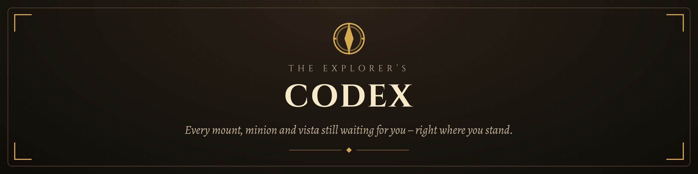
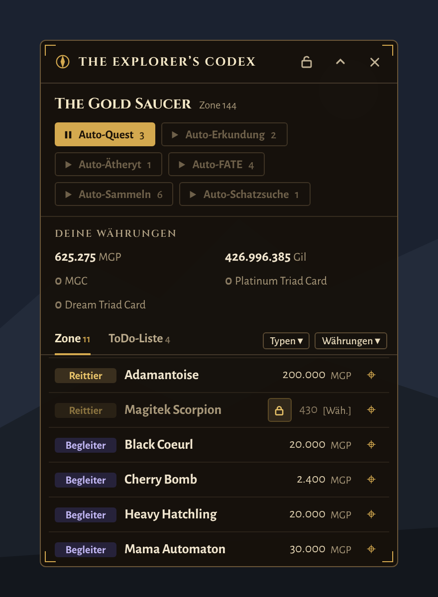

<p align="center">
  
</p>

<p align="center">
  <b>A Dalamud plugin for Final Fantasy XIV that shows every collectible you are still missing – in the zone you are standing in.</b>
</p>

<p align="center">
  <a href="https://github.com/stoni89/explorers-codex/releases"></a>
  <a href="https://github.com/stoni89/explorers-codex/issues"></a>
  
  
</p>

<p align="center">
  <a href="#-features">Features</a> ·
  <a href="#-installation">Installation</a> ·
  <a href="#-getting-started">Getting started</a> ·
  <a href="#-required-plugins">Required plugins</a> ·
  <a href="#-feedback--bug-reports">Feedback</a>
</p>

---

## 🧭 What is The Explorer's Codex?

You arrive in a new zone and wonder: *Is there still a mount to buy here? A minion, an orchestrion roll, a sightseeing vista I never logged?*

The Explorer's Codex answers that the moment you step in. A compact overlay lists everything **you have not unlocked yet** in your current zone, together with its price and what you need to get it. Tick things off, add them to your to-do list, or let the automation walk you there.

<p align="center">
  
</p>

---

## ✨ Features

- **Zone list:** every missing collectible in your current zone, with a type badge and its price.
- **To-do list:** pin entries from any zone and track them across the whole game.
- **Your currencies at a glance:** MGP, Gil, tomestones, scrips and more, with retainer stock if you like.
- **Filters by type and currency:** active filters are highlighted, so you always know what is hidden.
- **Locked entries explain themselves:** hover the lock and the tooltip tells you which quest or requirement is missing.
- **Auto buttons:** Auto Quest, Auto Sightseeing, Auto Aetheryte and more. A button only appears when there is something left to do, and only one runs at a time.
- **Category order:** decide whether mounts, minions, cards or emotes come first.
- **Collectible database:** every collectible the plugin can track, across every zone, with your current status.
- **Statistics:** totals per category and your overall completion, at a glance.
- Adjustable transparency, so it can sit quietly over your game.

---

## 📦 Installation

The Explorer's Codex is distributed through a custom Dalamud repository.

1. In game, open the Dalamud settings with `/xlsettings` and go to **Experimental**.
2. Under **Custom Plugin Repositories**, paste this URL and click **+**:
   ```
   https://raw.githubusercontent.com/stoni89/DalamudPlugins/main/repo.json
   ```
3. Click **Save**, then open the plugin installer with `/xlplugins`.
4. Search for **The Explorer's Codex** and click **Install**.

> [!IMPORTANT]
> Only add repositories you trust. Custom plugins are not reviewed by the Dalamud team.

> [!NOTE]
> Used the old `https://raw.githubusercontent.com/stoni89/explorers-codex/main/repo.json` URL before? It still works for now, but remove it once you have added the URL above, so the plugin does not show up twice.

---

## 🚀 Getting started

| Command | What it does |
|---|---|
| `/exc` | Opens The Explorer's Codex. |

1. Open the menu with `/exc` (run it again to close it) and choose your language under **General**. By default the plugin follows your game client.
2. Turn on the overlay. It appears automatically in every zone with something left to collect.
3. Hover an entry for details, or click the pin to add it to your to-do list.

---

## 🔌 Required plugins

These plugins are needed for the automation features:

| Plugin | Used for |
|---|---|
| vnavmesh | Pathfinding and walking for every automation (aetheryte, quest, hunting log, go-to). |
| Questionable | Drives the quest automation to accept and complete quests automatically. |
| Lifestream | Traveling between districts of a split capital city during automation. |
| Saucy | Plays the Triple Triad matches against NPC opponents during the Triple Triad automation, until all of their cards have dropped. |
| TextAdvance | Automatically clicks through dialogue and cutscenes during the quest automation. |
| RotationSolver Reborn **or** Wrath Combo | Combat plugin: handles the hunting log kill automation, combat-required quest steps, and fending off attackers during the sightseeing automation (one of the two is enough). |

## 🧩 Optional plugins

| Plugin | Used for |
|---|---|
| Allagan Tools | Shows retainer stock next to your currencies. |

The **Plugins** page in the menu shows what is installed and what is missing.

---

## 💬 Feedback & bug reports

Found a bug, missing an item or have an idea for a feature? Please open an [issue](https://github.com/stoni89/explorers-codex/issues).

For bug reports, the following helps a lot:
- your plugin version (shown on the **About** page, and next to the logo in the sidebar),
- the zone and the entry it is about,
- the relevant lines from the **Log** page (use *Copy all*).

---

<p align="center">
  <sub>FINAL FANTASY is a registered trademark of Square Enix Holdings Co., Ltd. This project is not affiliated with or endorsed by Square Enix.</sub>
</p>
